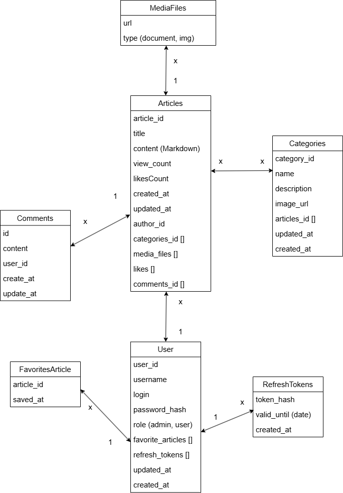

# Проект "База знаний"

## Функциональное содержание приложения:

- Статьи по интерисующим темам
- Статьи распределены по категориям, у каждой статьи может быть несколько категорий (подобно Хабру)
- Поиск статьи внутри раздела конкретной категории
- Глобальный поиск по всей базе знаний
- Полноценная аунтификация/авторизация (с ролями) пользователя
- Админка
  - Категории
    - Создание
    - Удаление
    - Редактирование
  - Статьи
    - Создание
    - Удаление
    - Редактирование
- Все манипуляции связанные с редактирование статьи происходит через Markdown, для гибкой настройки визумального отображения статьи (жирность текста, ссылки, таблица и т.д.)

### Возможности пользователей (пользователь/админ):

- Пользователь
  - Просмотр категорий, статей
  - Просмотр конкретной статьи или категории
  - Создание/редактирование/удаление статьи относительно существующей категории
  - Лайк статьи
  - Добавление в избранное статьи
  - Комментирование статьи
- Администратор
  - Все права пользователя
  - Возможность создание/редактирование/удаление категории
  - Возможность удаление статей пользователей
  - Возможность удаление комментов пользоваталей

## UML Диаграмма сущностей (предполагается использование NoSQL базы данных)

## Технологии

- NoSQL База данных MongoDB (т.к. будет хранится большой объем текстовой информации)
- Prisma ORM, для удобного взаимодействия с базой и отличной совместимостью с Nest + TS
- Minio S3 хранилище для медиайфалов (изображения, документы).
- Бекенд: Nest (Фреймворк для написания серверных приложение на Node JS)
- Фронтенд: Next 15 (Фреймворк React для написания Fullstak приложение, с концепцией серверной генерацией компонентов)
